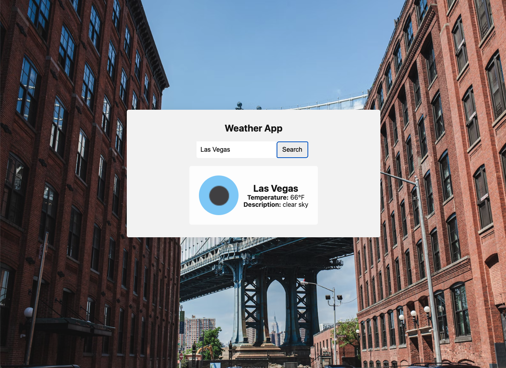

# 🌦️ Electron Weather App

A simple, clean desktop weather application built using HTML, CSS, JavaScript, and Electron. It fetches current weather data from the OpenWeather API based on user input and displays it in a responsive UI.

---

## 🚀 Features

- Electron-based desktop application
- Search weather by city name
- Fetches real-time weather data from OpenWeather API
- Clean dark-mode UI that adapts to system preference
- Optimized for readability and accessibility

---

## 📦 Tech Stack

- HTML5, CSS3, JavaScript (Vanilla)
- OpenWeather API
- Electron

---

## 🛠️ Setup Instructions

1. Clone this repository:

    ```bash
    git clone https://github.com/your-username/weather-app.git
    cd weather-app
    ```

2. Install dependencies:

    ```bash
    npm install
    ```

3. Add your OpenWeather API key:

    Create a file named config.js in the root directory and paste:
   
    ```bash
    const apiKey = "YOUR_API_KEY_HERE";
    ```

    (This file is .gitignored for safety.)

4. Start the app:

    ```bash
    npm start
    ```

---

## 📁 File Structure

```bash
weather-app/            
├── main.js             
├── index.html          
├── script.js           
├── style.css           
├── config.js           
├── package.json        
└── README.md           
```

---

## 💡 Notes

- Dark/light mode styling responds to your system setting.
- Your API key must be active and correct for fetches to work.
- No sensitive data is committed — `config.js` is in `.gitignore`.

---

## 🖼️ Screenshots



---

## 📜 License

MIT License

---

Made with 💻 + ☕ by Alexander Choi